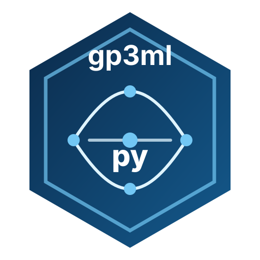

<div class="gp-hero" markdown>
<div markdown>
<span class="gp-kicker" style="color:#bfe9ff">Python port of gp3ml 0.3.0</span>

# Governance-first predictive modelling for Gazepoint research

`gp3mlpy` brings gp3ml's leakage-resistant, group-aware modelling contracts to Python: explicit scientific tasks, provenance-aware predictors, participant/stimulus generalization, fold-local preprocessing, governed tuning and thresholds, uncertainty, transportability, reproducibility, and auditable release artifacts.

<div class="gp-actions">
<a href="key-concepts/">Start with the key concepts</a>
<a href="articles/">Browse articles</a>
<a href="reference/">Open the API map</a>
<a href="https://github.com/stefanosbalaskas/gp3mlpy">GitHub</a>
</div>
</div>
<div>

</div>
</div>

<div class="gp-stats">
<div class="gp-stat"><strong>127</strong><span>compatibility exports</span></div>
<div class="gp-stat"><strong>71</strong><span>stable exports</span></div>
<div class="gp-stat"><strong>38</strong><span>stable public classes</span></div>
<div class="gp-stat"><strong>20</strong><span>article companions</span></div>
</div>

## What makes gp3mlpy different

<div class="gp-card-grid" markdown>

<div class="gp-card" markdown>
<span class="gp-kicker">Scientific target first</span>
### Generalization is declared, not inferred
Participant, stimulus, and combined generalization targets determine which overlaps are permissible. A split that violates the scientific target is rejected rather than silently accepted.
</div>

<div class="gp-card" markdown>
<span class="gp-kicker">Leakage resistance</span>
### Fitted operations stay inside the right partition
Preprocessing, tuning, calibration, threshold selection, and uncertainty estimation remain tied to the correct analysis/fold structure.
</div>

<div class="gp-card" markdown>
<span class="gp-kicker">Auditability</span>
### Every important modelling choice can leave evidence
Feature manifests, fold diagnostics, model cards, external-validation reports, environment capture, checksums, handoffs, RO-Crate export, and release evidence are first-class workflow objects.
</div>

<div class="gp-card" markdown>
<span class="gp-kicker">Governance boundary</span>
### Explicitly observed, non-sensitive outcomes only
The package retains gp3ml's prohibited-use boundary and is not intended for identity, protected-attribute, health, biometric-authentication, or mental-state inference.
</div>

<div class="gp-card" markdown>
<span class="gp-kicker">Parity without overclaiming</span>
### API, semantic, numerical, and algorithmic parity are separated
Python-native adapters preserve gp3ml workflow semantics without falsely claiming bitwise or algorithmic identity when the backend differs from R.
</div>

<div class="gp-card" markdown>
<span class="gp-kicker">No hidden AutoML</span>
### Selection remains visible
`gp3mlpy` does not silently choose a winner, relax grouping, tune on assessment data, or invent a default threshold to make a model appear successful.
</div>

</div>

## The governed workflow

<div class="gp-pipeline">
<div class="gp-step"><strong>1 · Declare</strong><span>Outcome, use case, unit, IDs, and generalization target.</span></div>
<div class="gp-step"><strong>2 · Audit</strong><span>Feature provenance, role validity, and leakage risks.</span></div>
<div class="gp-step"><strong>3 · Split</strong><span>Group-aware holdout or repeated/nested resampling.</span></div>
<div class="gp-step"><strong>4 · Fit</strong><span>Fold-local preprocessing, governed engines, tuning, calibration.</span></div>
<div class="gp-step"><strong>5 · Evaluate</strong><span>Performance, uncertainty, thresholds, conformal coverage, robustness.</span></div>
<div class="gp-step"><strong>6 · Report</strong><span>External validation, model cards, provenance, checksums, bundles.</span></div>
</div>

## Minimal governed workflow

```python
import gp3mlpy as gp

predictors = [
    "tracking_ratio",
    "blink_rate",
    "fixation_duration",
    "gaze_dispersion",
    "pupil_change",
]

data = gp.simulate_gazepoint_governed_data(
    n_participants=18,
    n_stimuli=4,
    trials_per_cell=1,
    seed=17,
)

task = gp.create_gazepoint_synthetic_task(
    data,
    workflow="assigned_condition",
    generalization_target="new_participants",
)

manifest = gp.create_gazepoint_synthetic_manifest(task.outcome, predictors)

folds = gp.create_gazepoint_group_folds(
    data=data,
    outcome=task.outcome,
    predictors=predictors,
    feature_manifest=manifest,
    generalization_target=task.generalization_target,
    participant_id=task.participant_id,
    trial_id=task.unit_id,
    stimulus_id=task.stimulus_id,
    v=3,
    repeats=1,
    seed=17,
)

evaluation = gp.evaluate_gazepoint_group_folds(
    folds,
    task,
    predictors,
    engine="glm",
    seed=17,
)

assert gp.validate_gazepoint_resample_evaluation(evaluation).status == "pass"
```

## Plot contracts

The documentation build regenerates example figures from the current Python package. These are synthetic rendering fixtures, not scientific results.

<div class="gp-plot-grid">
<div class="gp-plot-card">

<div><strong>Decision thresholds</strong><br>Inspect explicitly declared candidate thresholds without hidden optimization.</div>
</div>
<div class="gp-plot-card">

<div><strong>Dataset shift</strong><br>Visualize predictor-distribution differences separately from calibration and performance.</div>
</div>
<div class="gp-plot-card">

<div><strong>Engine portability</strong><br>Make optional backend availability visible before fitting.</div>
</div>
<div class="gp-plot-card">

<div><strong>Governance evidence</strong><br>Surface controls with evidence and controls that still require review.</div>
</div>
</div>

[Open the complete plot gallery →](plots.md)

## Choose a learning path

<div class="gp-card-grid" markdown>

<div class="gp-card" markdown>
### I am new to gp3mlpy
Read [Key concepts](key-concepts.md), then work through the [Integrated research workflow](articles/integrated-research-workflow.md).
</div>

<div class="gp-card" markdown>
### I need participant-safe validation
Start with [Participant generalization](articles/participant-generalization.md) and [Nested grouped resampling](articles/nested-grouped-resampling.md).
</div>

<div class="gp-card" markdown>
### I am preparing a reproducible study
Use [Analysis-plan governance](articles/analysis-plan-governance.md), [Reproducibility hardening](articles/reproducibility-hardening.md), and [Portable research artifacts](articles/portable-research-artifacts.md).
</div>

<div class="gp-card" markdown>
### I need external validation
See [External validation reporting](articles/external-validation-reporting.md) and [Dataset shift and robustness](articles/dataset-shift-and-robustness.md).
</div>

<div class="gp-card" markdown>
### I need governed classification decisions
See [Decision governance](articles/decision-governance.md) and [Group-aware conformal prediction](articles/group-aware-conformal-prediction.md).
</div>

<div class="gp-card" markdown>
### I need a function quickly
Use the [API map](reference/index.md) or the site search. All 127 compatibility exports have dedicated reference pages.
</div>

</div>

## Installation

=== "pip"

    ```bash
    python -m pip install -e .
    ```

=== "uv"

    ```bash
    uv sync --extra dev --extra docs
    ```

Optional extras include `xgboost`, `deep`, `conformal`, `rocrate`, and `artifact`.

## Frozen reference

`gp3mlpy.r_reference_version == "0.3.0"`. The repository carries machine-readable R API, class, vignette, print/plot, failure-contract, and test inventories under `reference/` so compatibility claims remain inspectable.

!!! warning "Scientific safeguards are part of the package contract"
    Do not use `gp3mlpy` for person identification, biometric authentication, health or diagnosis inference, protected-attribute inference, or direct/indirect inference of emotion, stress, personality, deception, cognition, comprehension, intent, or other mental states.
